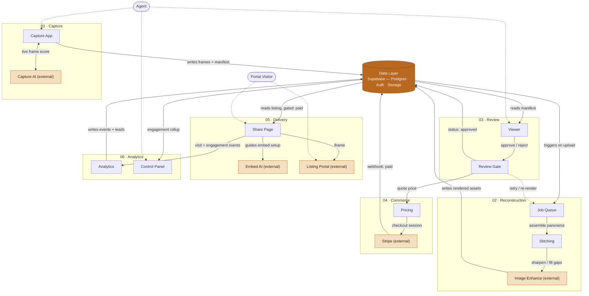

# Sodar.io — Core Architecture

Browser-based tool for real estate agents: scan a property room-by-room with a
phone, get an AI-reconstructed 360° tour, pay a one-time fee sized to the
listing, embed the result as an iframe on any listing portal, then track
engagement (visits, leads, timestamps) from a control panel.

The product is mostly an orchestration layer over third-party services, not a
hand-rolled stack — the diagram below marks every external dependency
explicitly so that's visible at a glance, not just asserted.

## System map

One data core (Supabase), six functional clusters around it, two people who
touch the system. Dashed lines are actor interactions or the one retry loop;
`(external) ` marks a third-party dependency.



## Clusters

| # | Cluster | Nodes | Mechanism |
|---|---|---|---|
| 01 | Capture | Capture App, Capture AI *(ext)* | Only two-way edge in the system — frame goes up, a quality score comes back in real time, while the agent is still in the room. |
| 02 | Reconstruction | Job Queue, Stitching, Image Enhance *(ext)* | Async — a multi-room job runs past any HTTP timeout. Queue and stitching are owned; enhancement is where an external image model replaces what a hand-rolled pipeline would otherwise do. |
| 03 | Review | Viewer, Review Gate | The gate before money moves — nobody pays for a render they haven't seen. Reject re-queues reconstruction (the one retry loop). |
| 04 | Commerce | Pricing, Stripe *(ext)* | Quote computed deterministically from room/frame/area counts already on the manifest. Stripe owns checkout UI and receipts; a webhook is the only state change on our side. |
| 05 | Delivery | Share Page, Embed AI *(ext)*, Listing Portal *(ext)* | Share Page is gated on `status = paid`. Embed AI is scoped to portal-specific setup instructions, not a general assistant. |
| 06 | Analytics | Analytics, Control Panel | Every visit + lead becomes an event; Control Panel is the per-agent rollup — visits, leads, timing, source portal. |

## Data layer

One Postgres schema (Supabase), replacing the current flat manifest.json +
JSONL-per-scan approach. `agent_id` ownership and a status lifecycle are the
two things that don't exist at all yet.

```
agents            id, email, org, created_at
scans             id, agent_id, status, created_at
frames            scan_id, filename, heading, quality*
rooms             scan_id, name, start_frame, end_frame
listings          scan_id, title, address, price_quote
payments          scan_id, stripe_session_id, status
leads             scan_id, name, email, phone, status
analytics_events  scan_id, event_type, ts, referrer
```

`status`: `capturing → rendering → ready_for_review → approved → paid`
`*quality`: blur, exposure_score, rotation_rate, delta_yaw

## Infra

Not part of the diagram above — it's where the nodes run, not a data-flow
node itself.

- **Marketing site** — static, stays on Vercel, unchanged.
- **Product backend** (Job Queue + reconstruction chain) — needs a
  persistent process and real compute time. Rules out serverless functions
  with ephemeral filesystems; needs a container host (Fly.io / Render /
  Railway) with the worker scaled independently from the web tier.

## Build sequence

1. Data layer — Supabase auth + schema
2. Ingest & storage — object storage, upload path
3. Status lifecycle + review gate — unlocks everything downstream that checks scan state
4. Pricing + payment — Stripe, gated on status
5. Embed gating — paywall in front of the share page
6. Control panel rollup — per-agent view
7. Reconstruction pipeline — worker/queue, can run in parallel with 1–6
8. Infra split — move backend off single-process hosting
9. Capture AI + Embed AI — the two genuinely new AI surfaces, once the pipeline they feed is stable

## Open questions

Names that came up in scoping that don't have a confirmed place yet:
`Sigma`, `Admanage`, `Omni`, `Claude Commerse`, `Stich`, `Impeccable`,
`Leanxlnx`, `Sensor LLC`, `Graphify`, `SPAG-4D` — flagged rather than guessed
into a slot. A repo link or one-line description per item would resolve these.

## Engineering harness

`src/sodar/` is a small local harness that plugs candidate external providers in
behind one stable contract (`sodar.providers.base`) and evaluates them
deterministically against local fixtures — no network, no cloud. It runs on a
bare Python 3.11+ interpreter (`python -m unittest discover -s tests`); planning
and design notes live in [`wat/`](wat/) and [`docs/`](docs/).

```
sodar provider list
sodar provider run <provider> <fixture>
sodar eval run <provider> <fixture>      # persists artifacts/evals/<run_id>/eval-result.json
```

Providers:

| id | dependency | notes |
|---|---|---|
| `dummy` | none | deterministic reference provider |
| `opencv-stitch` | `opencv-python-headless` (Apache-2.0), optional extra `[opencv]` | OpenCV panorama stitching; output is not byte-reproducible — see [`docs/HARNESS_NOTES.md`](docs/HARNESS_NOTES.md) |

Install an optional provider's dependency with e.g. `pip install -e ".[opencv]"`.
The default install stays dependency-free.
